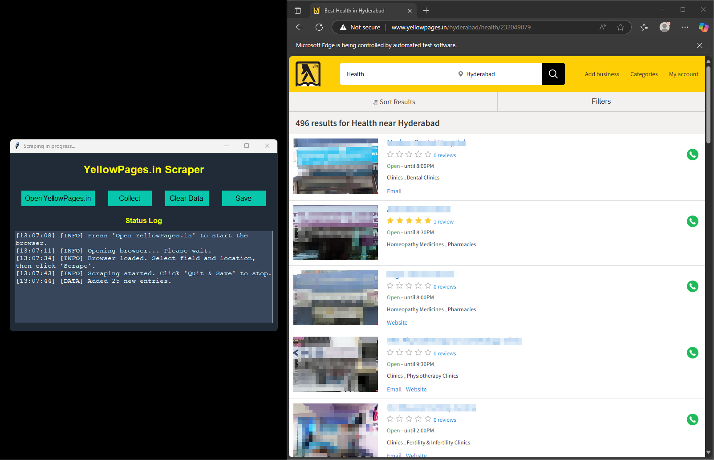
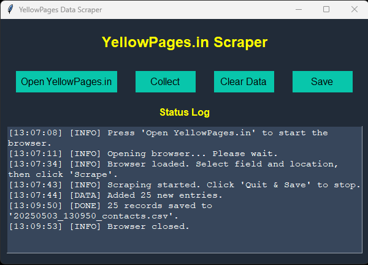

# YellowPages.in Data Scraper

<p align="center">
  
</p>

A simple Python application with a **Tkinter GUI** that uses **Selenium WebDriver (Microsoft Edge Chromium)** to scrape **business names, emails, and phone numbers** from [YellowPages.in](http://www.yellowpages.in).

✅ Opens a browser for manual search input
✅ Collects data every few seconds from visible page blocks
✅ Exports collected data into a CSV file
✅ Logs scraping status inside the app

---

## 🚀 Features

* **Human-like scraping delay** (2–4 seconds randomized) to avoid rapid bot detection
* **GUI interface** for non-technical users
* **Real-time status log** in the application
* **Data deduplication** (avoids saving duplicate entries)
* **Threaded scraping** (keeps UI responsive)
* **Colorful themed interface**

## 🖼️ GUI Preview (Working Example)

<p align="center">
  
</p>

<p align="center">
  
</p>

*Above: A live screenshot of the scraper in action.*


---


## 💻 Installation & Usage

1. Install dependencies:

   ```bash
   pip install selenium
   ```
2. Ensure you have **Microsoft Edge** installed with a compatible `msedgedriver` in PATH
3. Run the script:

   ```bash
   python wholeContact.py
   ```
4. In the app:

   * Click **Open YellowPages.in** → manually enter your desired **search and location**
   * Click **Collect** to start scraping
   * Click **Save** to stop scraping and export CSV
   * Click **Clear Data** to reset collected results

The scraper collects from **visible search results on the current page**—pagination is manual.

---

## 📂 Output

Saved files are named as:

```bash
YYYYMMDD_HHMMSS_contacts.csv
```

Each row contains:

| Name            | Email                                         | Phone Number |
| --------------- | --------------------------------------------- | ------------ |
| Business Name 1 | [example1@mail.com](mailto:example1@mail.com) | 1234567890   |
| Business Name 2 | [example2@mail.com](mailto:example2@mail.com) | 9876543210   |
| Business Name 3 | [info@company.com](mailto:info@company.com)   | 5551234567   |
| Business Name 4 | [contact@biz.com](mailto:contact@biz.com)     | 4449876543   |
| Business Name 5 | [sales@store.com](mailto:sales@store.com)     | 3332221111   |

---

## 📝 Customization

* To auto-close the browser after saving, uncomment the related code in `stop_scraping()` function.
* To change wait times, edit the `human_like_wait()` and scraping interval inside `start_scraping_loop()`.

---

## 📧 About onlyMails.py


`onlyMails.py` is a simplified version of the scraper that focuses **only on collecting emails**.

### 🟢 Benefits:

* Lightweight and faster setup.
* No GUI; just opens browser and collects emails.
* Less dependencies and simpler code.

### 🔴 Limitations:

* **Emails only**: no name or phone collection.
* No real-time status logging or progress UI.

This version saves files as:

```bash
YYYYMMDD_HHMMSS.csv
```

Each row contains **just one email**:

| Email                                               |
| --------------------------------------------------- |
| [example1@mail.com](mailto:example1@mail.com)       |
| [example2@mail.com](mailto:example2@mail.com)       |
| [info@company.com](mailto:info@company.com)         |
| [contact@biz.com](mailto:contact@biz.com)           |
| [sales@store.com](mailto:sales@store.com)           |
| [support@helpdesk.com](mailto:support@helpdesk.com) |
| [team@enterprise.com](mailto:team@enterprise.com)   |

---


## ⚠️ Disclaimer

🛑 **IMPORTANT: This tool is for educational purposes only.**

* Scraping [YellowPages.in](http://www.yellowpages.in) **violates their Terms of Service**.
* This code **does not bypass bot detection or anti-scraping mechanisms**—instead, it loads the site normally in a browser and lets you manually input fields.
* Any scraping of the site should comply with legal, ethical, and robots.txt rules.
* I do not encourage scraping sites that prohibit automated data collection.

**This project is intended as a learning example of Selenium, Tkinter, and data extraction techniques, not as a production tool.**

---

## 📝 Notes

* This scraper **does not spoof headless browsing** or aggressively avoid detection.
* Since it waits for manual input and runs in a full browser session, it **mimics a human user** more closely than headless bots.
* It only scrapes content **currently visible on the page**—no automated navigation or pagination.

---

Feel free to update the image path and let me know if you'd like to add installation instructions for other environments or drivers!
